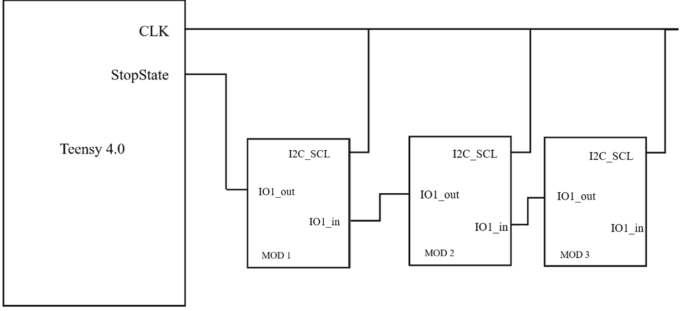
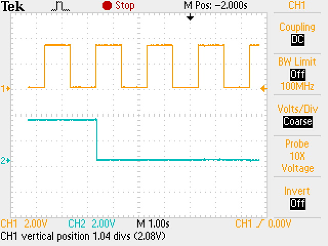
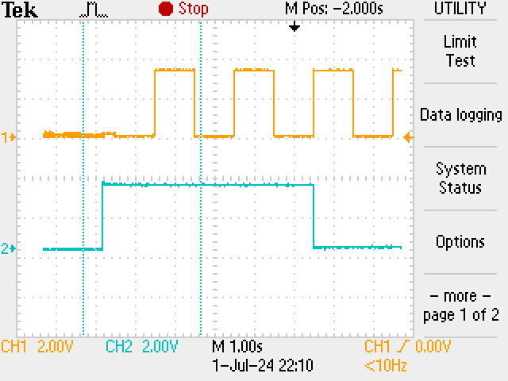
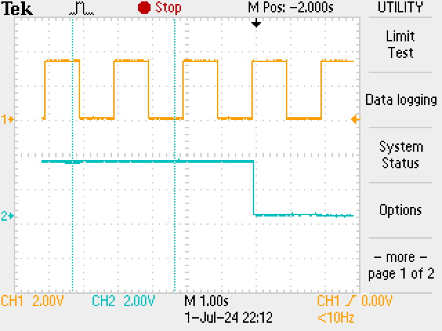

# Initialisation Protocol (V2)
## Description
Each module is connected to a clock signal from the controller. Also each module as an stop signal input connected to the previous module stop signal output. 

Each module in the chain counts the rising edges of the clock signal until it reads a "stop signal" (LOW) from the previous module. When a stop signal has been received the module stop counting and assigns itself an internal address based on the number of clock edges counted. It then sets its stop signal output to LOW for the next clock cycle, this allow the next module to set its internal address with address 1 higher than the previous module. This process continues until all modules have assigned themselves unique addresses. The diagram shows the states of the clock, the output signals of the controller and each module, and the internal addresses of the modules at each step.

B','B~>C','C~>D','D~>E','E~>F','F~>G'],config:{hscale:2,y0:-20},head:{text:'Address Assignment Sequence',tick:0,tickWidth:1,tickLabel:0}}"/>

```wavedrom
{
  "signal": [
    {"name": "Clock", "wave": "0P..|", "color": "blue"},
    {"name": "Controller Out", "wave": "10...|", node: '.A........', "color": "red"},
    {"name": "Module 1", "wave": "==...|", "data": ["Address 0", "Address 1"], node: '..B.......',"color": "green"},
    {"name": "M1 Out", "wave": "1.0..|", node: '..C......',"color": "red",},
    {"name": "Module 2", "wave": "===..|", "data": ["Address 0", "Address 1", "Address 2"],node: '...D.......', "color": "green"},
    {"name": "M2 Out", "wave": "1..0.|",node: '...E.......', "color": "red"},
    {"name": "Module 3", "wave": "====.|", "data": ["Address 0", "Address 1", "Address 2", "Address 3"],node: '....F......', "color": "green"},
    {"name": "M3 Out", "wave": "1...0|", node: '....G...',"color": "red"},
   
  ],
  "edge": ['A~>B','B~>C','C~>D','D~>E','E~>F','F~>G'],
  "config": { "hscale": 2, "y0": -20 },
  "head": {
    "text": "Address Assignment Sequence",
    "tick": 0,
    "tickWidth": 1,
    "tickLabel": 0
  }
}
```
## Changes from V1
4 modules were used for testing. Within each module, instead of tracking every value that the pin reads, the function PORT3_IRQHandler() only runs when an IRQ is triggered. Also, unlike the previous version, where the stopState is sent after a delay of 1000ms, the stopState is sent when the pin receives the next rising edge after the module has stopped counting. In this case, the frequency of the CLK signal can be adjusted freely.

From my observation, modules are now able to run main() while counting rising edges (only counting when the pin receives a rising edge and is interrupted). Here are what the LED colours indicate before settling for the final colour:
* Blue: running the main loop.
* Blinks red: adds 1 count/ received a rising edge

The colour of the LED indicates the internal address:
* Red: internal address is 1
* Orange: internal address is 2
* Yellow: internal address is 3
* Green: internal address is 4

In terms of wiring and pin selection, only the FPC cable (communication bus) was used. No extra wires are added to the PCBs.

## Code 
```c++
#include "gpio.h"
#include "i2c.h"
#include "rgb.h"

// pin 34, 33, 32, 03, 15 are used for address output
// these pins can be found on the hc32l110 datasheet
// pin numbers 1-20, which shows their location on the 
// controller are labelled on the diagram. The table 
// underneath shows the pin name for each pin (e.g. pin 
// number 2 is labelled as P01). In this case, pin number
// 18 (P34), 17 (P33), 16 (P32), 7 (P03), and 8 (P15) are
// used. The first digit in the pin name refers to the 
// port whereas the second digit refers to the pin. Port
// is essentially a group of pins. 

#define CLVHD_ADD0_PORT 3
#define CLVHD_ADD0_PIN 4
#define CLVHD_ADD1_PORT 3
#define CLVHD_ADD1_PIN 3
#define CLVHD_ADD2_PORT 3
#define CLVHD_ADD2_PIN 2
#define CLVHD_ADD3_PORT 0
#define CLVHD_ADD3_PIN 3
#define CLVHD_ADD4_PORT 1
#define CLVHD_ADD4_PIN 5

// I2C on pins SDA: 35, SCL: 36
#define CLVHD_SDA_PORT 3
#define CLVHD_SDA_PIN 5
#define CLVHD_SCL_PORT 3
#define CLVHD_SCL_PIN 6

uint8_t r = 255, g = 0, b = 0;

uint8_t module_address = 0x01;
uint8_t module_initiated = 0;

#define CLVHD_DIN_PORT (0)
#define CLVHD_DIN_PIN (2)
#define CLVHD_DOUT_PORT (3)
#define CLVHD_DOUT_PIN (1)
#define CLVHD_DATA_PORT (3)
#define CLVHD_DATA_PIN (5)
#define CLVHD_CLK_PORT (3)
#define CLVHD_CLK_PIN (6)

#define HIGH 1
#define LOW 0

void Gpio_SetIO(uint8_t port, uint8_t pin, uint8_t value)
{
    if (value)
    {
        GPIO_SetPinOutHigh(port, pin);
    }
    else
    {
        GPIO_SetPinOutLow(port, pin);
    }
}

void set_address(uint8_t address)
{
    Gpio_SetIO(CLVHD_ADD0_PORT, CLVHD_ADD0_PIN, address & 0x01); // set the first digit of the address (binary)
    Gpio_SetIO(CLVHD_ADD1_PORT, CLVHD_ADD1_PIN, (address >> 1) & 0x01); // set the second digit of the address (binary)
    Gpio_SetIO(CLVHD_ADD2_PORT, CLVHD_ADD2_PIN, (address >> 2) & 0x01); // set the third digit of the address (binary)
    Gpio_SetIO(CLVHD_ADD3_PORT, CLVHD_ADD3_PIN, (address >> 3) & 0x01); // set the fourth digit of the address (binary)
    Gpio_SetIO(CLVHD_ADD4_PORT, CLVHD_ADD4_PIN, (address >> 4) & 0x01); // set the fifth digit of the address (binary)
    module_address = address;
}

void CLVHD_ConfigPin(void)
{
    // configure P01 to control the neopixel
    RGB_Init();
    RGB_Reset();

    // set the address output pin as output
    Gpio_InitIOExt(CLVHD_ADD0_PORT, CLVHD_ADD0_PIN, GpioDirOut, FALSE, FALSE, FALSE, FALSE);
    Gpio_InitIOExt(CLVHD_ADD1_PORT, CLVHD_ADD1_PIN, GpioDirOut, FALSE, FALSE, FALSE, FALSE);
    Gpio_InitIOExt(CLVHD_ADD2_PORT, CLVHD_ADD2_PIN, GpioDirOut, FALSE, FALSE, FALSE, FALSE);
    Gpio_InitIOExt(CLVHD_ADD3_PORT, CLVHD_ADD3_PIN, GpioDirOut, FALSE, FALSE, FALSE, FALSE);
    Gpio_InitIOExt(CLVHD_ADD4_PORT, CLVHD_ADD4_PIN, GpioDirOut, FALSE, FALSE, FALSE, FALSE);

    Gpio_InitIOExt(3, 1, GpioDirIn, FALSE, TRUE, FALSE, FALSE); // Stop input
    Gpio_InitIOExt(3, 6, GpioDirIn, FALSE, TRUE, FALSE, 0); // CLK interrupt pin 
    Gpio_InitIOExt(0, 2, GpioDirOut, TRUE, FALSE, FALSE, FALSE); // Stop output
    Gpio_ClearIrq(3, 6);
    Gpio_EnableIrq(3, 6, GpioIrqRising);
    EnableNvic(PORT3_IRQn, DDL_IRQ_LEVEL_DEFAULT, TRUE);
}

volatile uint8_t flag;

uint8_t count = 0;
uint8_t stop = HIGH;
uint8_t total = 6; // total number of modules for testing 

void PORT3_IRQHandler(void)
{
    /** Clear interrupt flag before handling, otherwise it will be triggered twice */
    uint8_t stopState = GPIO_GetPinIn(3, 1);
    GPIO_SetPinOutHigh(0,2);
    Gpio_ClearIrq(3, 6);
    if(stopState==1){

        if (Gpio_GetIrqStat(3, 6)) // Interrupt not triggered. Can leave this block blank
        {
            RGB_SetColor(0,255,0);
            RGB_SetColor(0,255,0);
            delay1ms(10);
        }else{                     // Interrupt triggered by rising edge
            RGB_SetColor(255,0,0);
            RGB_SetColor(255,0,0);
            count=count+1;
            delay1ms(10); 
        }
    }else{                         // Pull chip select low (Stops the counting)
        if(Gpio_GetIrqStat(3,6)){
            stop = LOW;
        }else{
            stop = LOW;
        }
    }
}

// Trying to use interrupts 

int main(void)
{ 
    CLVHD_ConfigPin();

    const int colors[6][3] = {
        {255, 0, 0},   // Red
        {255, 127, 0}, // Orange
        {255, 255, 0}, // Yellow
        {0, 255, 0},   // Green
        {0, 0, 255},   // Blue
        {75, 0, 130}   // Purple 
    };

    while (1){
        GPIO_SetPinOut(0,2,stop);
        set_address(count);
        if(stop==LOW){
            RGB_SetColor(colors[count-1][0],colors[count-1][1],colors[count-1][2]);
            RGB_SetColor(colors[count-1][0],colors[count-1][1],colors[count-1][2]);
            delay1ms(10); 
        }else{
            RGB_SetColor(0, 0, 255);
            RGB_SetColor(0, 0, 255);
            delay1ms(10);
        }
    }
    
    return 0;
}

```
## Additional Pins

**IO1_out (15)**:
* Read StopState from the previous module
* Allows StopState to be propagated along the chain of modules

**IO1_in (3)**:
* Pulled LOW to stop the next module counting (i.e. send StopState to the next module)
* Allows StopState to be propagated along the chain of modules

**I2C_SCL (20)**: 
* Read CLK signal from the Teensy 4.0 controller 
* Shared between all modules
* Interrupt request (IRQ) is enabled. Each rising edge read by the pin sends a signal to the controller and the interrupt routine is carried out

## Figures 


Fig.1 Timing diagram for module with internal address 1. Ch.1 represents the CLK signal (I2C_SCL), Ch.2 represents StopState from the Teensy (IO1_out) and Ch.3 represents StopState from module 1 to module 2 (IO1_in)



Fig.2 Ch.1 represents the CLK signal. Ch.2 represents comparator output (CSB), which is pulled LOW when the module is selected (i.e. internal address matches the 5-bit address, which is 00010 in this case).



Fig.3 Ch.1 represents the CLK signal. Ch.2 represents comparator output (CSB), which is pulled LOW when the module is selected (i.e. internal address matches the 5-bit address, which is 00011 in this case).



Fig.4 Ch.1 represents the CLK signal. Ch.2 represents comparator output (CSB), which is pulled LOW when the module is selected (i.e. internal address matches the 5-bit address, which is 00100 in this case).

## Next Step
* Add an END bit, which is sent back to the Teensy, to show that all modules have been assigned an internal address
* Reinitialisation without having to turn off the device. (Not sure what needs to be changed)
