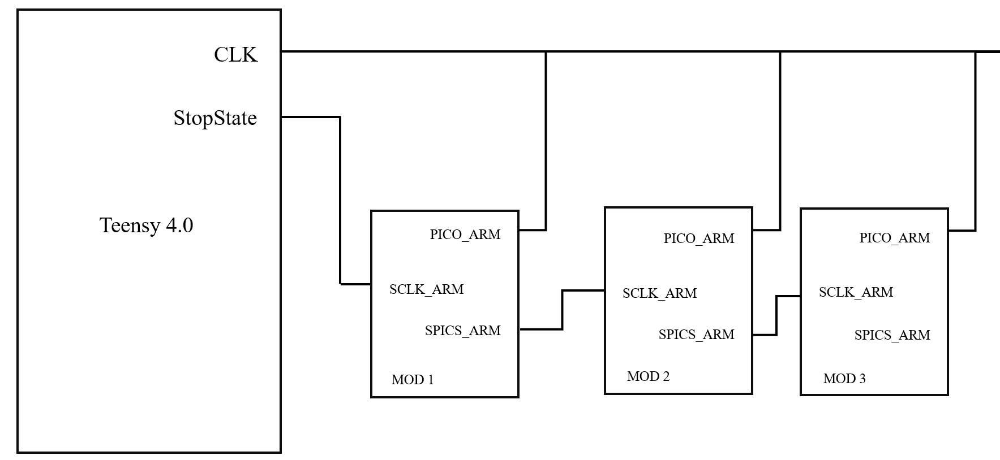
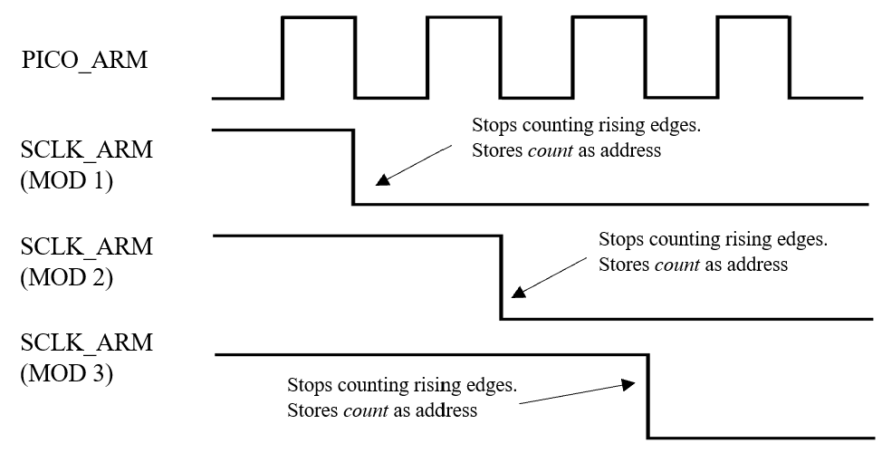
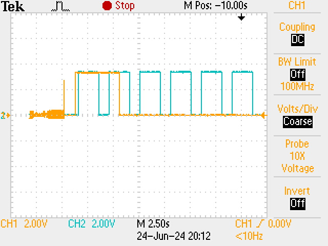
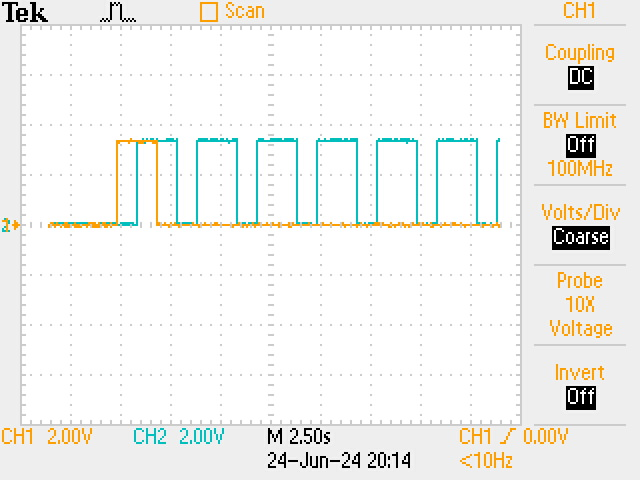

# Initialisation Protocol (V1)
## Method
### Overview
In essence, this method works on counting the number of rising edges in a common CLOCK (CLK) signal before the communication module is "told" to stop counting. The total number of counts is then used to set the internal address of the communication module.

The internal address of the modules in the chain should increase in increments of +1 for each subsequent module. The pinout for testing and the timing diagram are shown below in Figure 2 and 3.

### Schematic and Timing Diagram
In essence, this method works on counting the number of rising edges in a common CLOCK (CLK) signal before the communication module is "told" to stop counting. The total number of counts is then used to set the internal address of the communication module.

**PICO_ARM** is selected to be the pin for the CLK signal. The CLK is generated by the Teensy 4.0 controller. 
**SCLK_ARM** reads the signal from the previous module in the chain. This pin is set HIGH, then stops the module from counting rising edges when it is pulled LOW. This indicates the *StopState*.
**SPICS_ARM** is connected the SCLK_ARM pin of the next module in the chain and sends the StopState to the next communication module with a delay to stop the counting.

The internal address of the modules in the chain should increase in increments of +1 for each subsequent module. The pinout for testing and the timing diagram are shown below in Figure 2 and 3.


Fig.1 Pinout for testing


Fig.2 Timing diagram

### Code
For Teensy:
```C++
int state = 1;

void setup()
{
  pinMode(14,OUTPUT); //addr_bus_0
  pinMode(15,OUTPUT); //addr_bus_1
  pinMode(16,OUTPUT); //addr_bus_2
  pinMode(17,OUTPUT); //addr_bus_3
  pinMode(18,OUTPUT); //addr_bus_4
  pinMode(19,OUTPUT); //StopState
  pinMode(13,OUTPUT); //LED to show when pins are set to LOW
}

void loop()
{
  digitalWrite(14,LOW);
  digitalWrite(18,HIGH);
  digitalWrite(13,state);
  digitalWrite(19,state);
  delay(1000); // PWM: square waves with frequency 0.5Hz
  digitalWrite(14,HIGH);
  digitalWrite(18,HIGH);
  delay(1000);
  if(state==1){
    state=0;
  }else{
    state=0;
  }
  digitalWrite(13,state);
  digitalWrite(19,state);
  delay(1000);
  }
```

For hc32l110 microcontroller on each communication module:
```C++
#include "gpio.h"
#include "i2c.h"
#include "rgb.h"

// pin 34, 33, 32, 03, 15 are used for address output
// these pins can be found on the hc32l110 datasheet
// pin numbers 1-20, which shows their location on the 
// controller are labelled on the diagram. The table 
// underneath shows the pin name for each pin (e.g. pin 
// number 2 is labelled as P01). In this case, pin number
// 18 (P34), 17 (P33), 16 (P32), 7 (P03), and 8 (P15) are
// used. The first digit in the pin name refers to the 
// port whereas the second digit refers to the pin. Port
// is essentially a group of pins. 

#define CLVHD_ADD0_PORT 3
#define CLVHD_ADD0_PIN 4
#define CLVHD_ADD1_PORT 3
#define CLVHD_ADD1_PIN 3
#define CLVHD_ADD2_PORT 3
#define CLVHD_ADD2_PIN 2
#define CLVHD_ADD3_PORT 0
#define CLVHD_ADD3_PIN 3
#define CLVHD_ADD4_PORT 1
#define CLVHD_ADD4_PIN 5

// I2C on pins SDA: 35, SCL: 36
#define CLVHD_SDA_PORT 3
#define CLVHD_SDA_PIN 5
#define CLVHD_SCL_PORT 3
#define CLVHD_SCL_PIN 6

uint8_t r = 255, g = 0, b = 0;

uint8_t module_address = 0x01;
uint8_t module_initiated = 0;

#define CLVHD_DIN_PORT (0)
#define CLVHD_DIN_PIN (2)
#define CLVHD_DOUT_PORT (3)
#define CLVHD_DOUT_PIN (1)
#define CLVHD_DATA_PORT (3)
#define CLVHD_DATA_PIN (5)
#define CLVHD_CLK_PORT (3)
#define CLVHD_CLK_PIN (6)

#define HIGH 1
#define LOW 0

void Gpio_SetIO(uint8_t port, uint8_t pin, uint8_t value)
{
    if (value)
    {
        GPIO_SetPinOutHigh(port, pin);
    }
    else
    {
        GPIO_SetPinOutLow(port, pin);
    }
}

void set_address(uint8_t address)
{
    Gpio_SetIO(CLVHD_ADD0_PORT, CLVHD_ADD0_PIN, address & 0x01); // set the first digit of the address (binary)
    Gpio_SetIO(CLVHD_ADD1_PORT, CLVHD_ADD1_PIN, (address >> 1) & 0x01); // set the second digit of the address (binary)
    Gpio_SetIO(CLVHD_ADD2_PORT, CLVHD_ADD2_PIN, (address >> 2) & 0x01); // set the third digit of the address (binary)
    Gpio_SetIO(CLVHD_ADD3_PORT, CLVHD_ADD3_PIN, (address >> 3) & 0x01); // set the fourth digit of the address (binary)
    Gpio_SetIO(CLVHD_ADD4_PORT, CLVHD_ADD4_PIN, (address >> 4) & 0x01); // set the fifth digit of the address (binary)
    module_address = address;
}

void CLVHD_ConfigPin(void)
{
    // configure P01 to control the neopixel
    RGB_Init();
    delay1ms(1000);
    RGB_SetColor(0, 0, 0);
    RGB_SetColor(0, 0, 0);

    // set the address output pin as output
    Gpio_InitIOExt(CLVHD_ADD0_PORT, CLVHD_ADD0_PIN, GpioDirOut, FALSE, FALSE, FALSE, FALSE);
    Gpio_InitIOExt(CLVHD_ADD1_PORT, CLVHD_ADD1_PIN, GpioDirOut, FALSE, FALSE, FALSE, FALSE);
    Gpio_InitIOExt(CLVHD_ADD2_PORT, CLVHD_ADD2_PIN, GpioDirOut, FALSE, FALSE, FALSE, FALSE);
    Gpio_InitIOExt(CLVHD_ADD3_PORT, CLVHD_ADD3_PIN, GpioDirOut, FALSE, FALSE, FALSE, FALSE);
    Gpio_InitIOExt(CLVHD_ADD4_PORT, CLVHD_ADD4_PIN, GpioDirOut, FALSE, FALSE, FALSE, FALSE);

    // setup I2C
    Gpio_InitIOExt(3, 5, GpioDirOut, FALSE, FALSE, TRUE, FALSE);
    Gpio_InitIOExt(3, 6, GpioDirIn, FALSE, FALSE, TRUE, FALSE);
    Gpio_SetFunc_I2C_DAT_P35();
    Gpio_SetFunc_I2C_CLK_P36();

    set_address(8);

    // // Clock and Data
    // Gpio_InitIOExt(CLVHD_CLK_PORT, CLVHD_CLK_PIN, GpioDirIn, TRUE, FALSE, FALSE, 0);
    // Gpio_ClearIrq(CLVHD_CLK_PORT, CLVHD_CLK_PIN);
    // Gpio_EnableIrq(CLVHD_CLK_PORT, CLVHD_CLK_PIN, GpioIrqLow);
    // EnableNvic(PORT3_IRQn, DDL_IRQ_LEVEL_DEFAULT, TRUE);
    // Gpio_InitIOExt(CLVHD_DATA_PORT, CLVHD_DATA_PIN, GpioDirOut, FALSE, FALSE, FALSE, FALSE);

    // Chained INPUT
    Gpio_InitIOExt(CLVHD_DIN_PORT, CLVHD_DIN_PIN, GpioDirIn, TRUE, FALSE, FALSE, FALSE);

    // Chained OUTPUT
    Gpio_InitIOExt(CLVHD_DOUT_PORT, CLVHD_DOUT_PIN, GpioDirOut, FALSE, FALSE, FALSE, FALSE);
    Gpio_SetIO(CLVHD_DOUT_PORT, CLVHD_DOUT_PIN, HIGH);
}

volatile uint8_t flag;

void PORT3_IRQHandler(void)
{
    /** Clear interrupt flag before handling, otherwise it will be triggered twice */
    Gpio_ClearIrq(CLVHD_CLK_PORT, CLVHD_CLK_PIN);
    if (Gpio_GetIrqStat(CLVHD_CLK_PORT, CLVHD_CLK_PIN))
    {
        if (!module_initiated)
        {
            if (GPIO_GetPinIn(CLVHD_DIN_PORT, CLVHD_DIN_PIN)) // if the previous module is not initiated
            {
                RGB_SetColor(r, g, b);
                RGB_SetColor(r, g, b);
                module_initiated = 1;
                // Acknowledge the initialisation (by pulling the data line low for 50us)
                // Gpio_SetIO(CLVHD_DATA_PORT, CLVHD_DATA_PIN, LOW);
                // Gpio_SetIO(CLVHD_DATA_PORT, CLVHD_DATA_PIN, HIGH);

                // Propagate the initialisation to the next module
                Gpio_SetIO(CLVHD_DOUT_PORT, CLVHD_DOUT_PIN, HIGH);

                // set the current address
                set_address(module_address);
            }
            else
            {
                module_address++;
            }
        }
    }
}

int main(void)
{
    Gpio_InitIOExt(2, 6, GpioDirIn, FALSE, TRUE, FALSE, FALSE);
    Gpio_InitIOExt(2, 5, GpioDirIn, FALSE, TRUE, FALSE, FALSE);
    Gpio_InitIOExt(1, 4, GpioDirOut, FALSE, FALSE, FALSE, FALSE);
    // Gpio_InitIOExt(0, 1, GpioDirOut, FALSE, FALSE, FALSE, FALSE);

    CLVHD_ConfigPin();
    // RGB_Init();
    // RGB_Reset();
    uint8_t oldState = GPIO_GetPinIn(2, 6);
    uint8_t count = 0;
    uint8_t stopState = GPIO_GetPinIn(2, 5);
    
    while(1){
        GPIO_SetPinOutHigh(1,4);
        uint8_t stopState = GPIO_GetPinIn(2, 5);
        if(stopState==1){
            uint8_t pinState = GPIO_GetPinIn(2, 6);
            if(pinState>oldState){
                RGB_SetColor(0,255,0);
                delay1ms(10);
                count=count+1;
            }else{
                RGB_SetColor(0,0,0);
                delay1ms(10);
            }
            oldState = pinState;
            uint8_t stopState = GPIO_GetPinIn(2, 5);
        }else{
            RGB_SetColor(0,0,255);
            delay1ms(10);
            break;
        }
    }
    delay1ms(3000);
    GPIO_SetPinOutLow(1,4);
    set_address(count);
    
    return 0;
}
```

## Results
### Testing Address Pin Values
Testing was done using 3 modules for simplicity. Internal addresses were tested and observed on an oscilloscope by place a test probe at the address pins on the hc32l110 microcontroller. All modules were assigned the correct address based on their positions in the chain (i.e. the first module was assigned 1).

### Oscilloscope Screenshots


Fig.3 The yellow trace corresponds to the pin SCLK_ARM for module 2 and the blue trace represents the CLK signal. This screenshot was taking for module 2. It should count two rising edges based on this screenshot, which was proven correct using an oscilloscope and a test probe.



Fig.4 The yellow trace corresponds to the pin SCLK_ARM for module 1 and the blue trace represents the CLK signal. This screenshot was taking for module 1. It should count one rising edge based on this screenshot, which was proven correct using an oscilloscope and a test probe.

## Future Work
### Optimisation
The CLK signal is currently at a frequency of 0.5Hz. In comparison with previous measurements on the delay of signals (approximately 200ns depending on the length of the chain), the period of this CLK signal is relatively long, meaning that this process can be sped up by selecting a higher frequency for the CLK signal. This process can be optimised to save time. This would require better understanding on how delay is affected by the length of the chain. More measurments will be taken for this cause.

Besides, the pins used for this process should be selected wisely to make sure that the device remains compact. The pins selected at this stage is not optimal but it makes testing easier.  

### Restarting Initialisation 
To restart the initialisation process, the power source to the Teensy controller has to be removed. This is not optimal as it does not allow addition or removal of communication modules in the chain without restarting the device.
